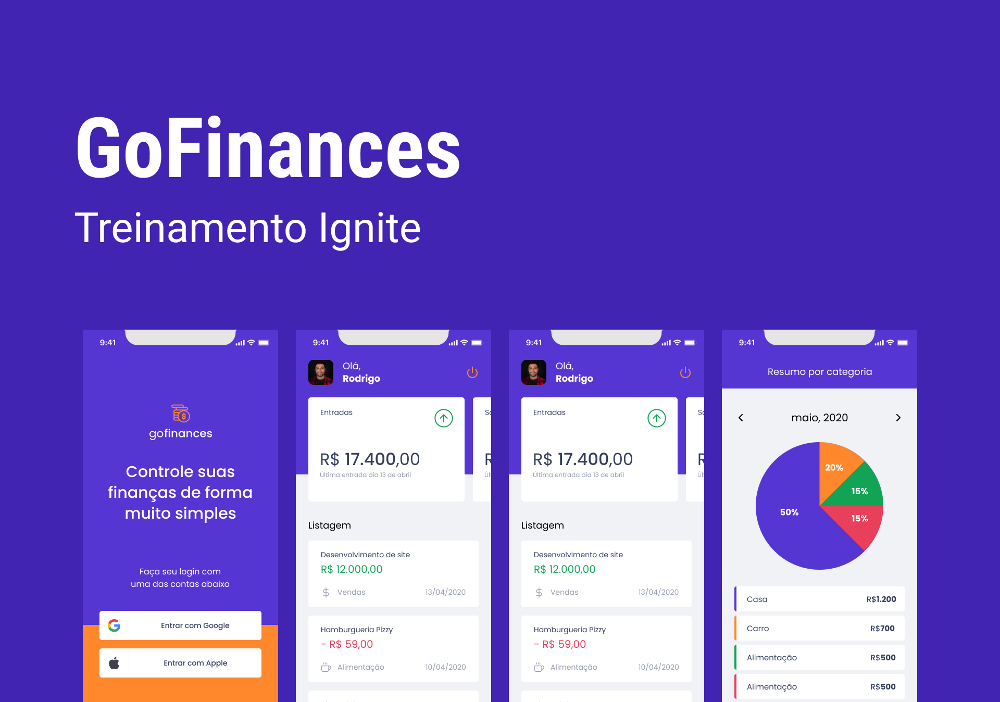

<h1 align="center">
    
</h1>

<p align="center">
  <a href="#-technologies">Tecnologias</a>&nbsp;&nbsp;&nbsp;|&nbsp;&nbsp;&nbsp;
  <a href="#-layout">Como executar</a>&nbsp;&nbsp;&nbsp;|&nbsp;&nbsp;&nbsp;
  <a href="#-project">Projeto</a>&nbsp;&nbsp;&nbsp;|&nbsp;&nbsp;&nbsp;
  <a href="#-license">License</a>
</p>

<br>

<p align="center">
  
</p>

---

## 🧪 Tecnologias

Esse projeto foi desenvolvido com as seguintes tecnologias:

- [React Native](https://reactnative.dev/)
- [Styled Components](https://styled-components.com/)
- [Expo](https://expo.io/)
- [TypeScript](https://www.typescriptlang.org/)
- [React Navigation](https://reactnavigation.org/)
- [Google Fonts](https://fonts.google.com/)
- [Date-Fns](https://date-fns.org/)
- [React Hook Form](https://react-hook-form.com/)
- [Victory Native](https://formidable.com/open-source/victory/)
- [React-native-svg](https://www.npmjs.com/package/react-native-svg)

## 🚀 Como executar

Clone o projeto e acesse a pasta do mesmo.

```bash
$ git clone https://github.com/jrxr/gofinances_mobile.git  && cd gofinances_mobile
```

Para iniciá-lo, siga os passos abaixo:
```bash
# Install the dependencies
$ yarn 
# Start the project
$ expo start
```

## 💻 Projeto

Aplicativo feito para controlar suas finanças de forma prática, somando suas receitas e despesas por categoria e ainda possuindo um gráfico informativo de despesas por categoria.


## 📝 License

Esse projeto está sob a licença MIT. Veja o arquivo [LICENSE](LICENSE.md) para mais detalhes.

---

Feito com 💜 by Agacy Júnior 💻